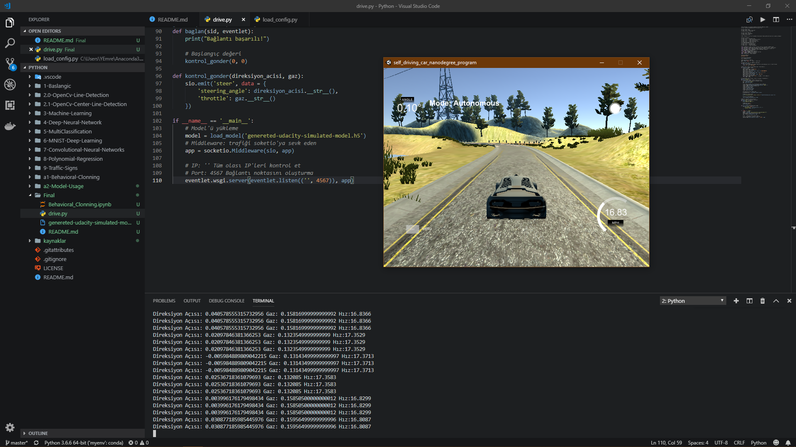

# Python

Genel python çalışmalarım.

> Çalışırken aldığım notlara [buraya](kaynaklar/genel_notlar.pdf) tıklayarak ulaşabilirsin.

## Notebook (.ipynb) dosyalarını açmak için

### Google Colab

Google colab ile notbook dosyalarını (.ipybn) [buraya](https://colab.research.google.com/) tıklayarak çalıştırabilirsin. 

> İndirme gerektirmez, bulut üzerinden çalışır ve oldukça **hızlıdır**. (*Bilgisayarını yormaz*)

> `Runtime - Change Runtime Type -  Hardware Accelator - GPU` seçmeyi unutmayın.

### Anaconda - Jupyter Lab

Anaconda3 indirerek, uygulama üzerinden jupyter lab'ı kullanabilirsin.

> Google Colab kullanman önerilir. Makine öğrenimi işlemleri cpu / gpu yoran işlemlerdir. Kendi bilgisayarını yorma :)

## Hazır Modeller

Tensotflow öğrenilmiş modeller için [buraya](https://github.com/tensorflow/models/blob/master/research/object_detection/g3doc/detection_model_zoo.md) tıklayabilirsin.

## Final
---
[Buraya](./Final) tıklayarak içeriğe erişebilirsin.

> Bu aşamadan itibaren `jupyter lab` yerine `google colab` kullanılması tavsiye edilir. Sistemi yoracak işlemlere başlanmıştır.

## a2. Model Usage
---
[Buraya](./a2-Behavioral-Clonning) tıklayarak içeriğe erişebilirsin.

> Bu aşamadan itibaren `jupyter lab` yerine `google colab` kullanılması tavsiye edilir. Sistemi yoracak işlemlere başlanmıştır.

## a1. Behavioral Clonning
---

[Buraya](a1-Behavioral-Clonning/Behavioral_Clonning.ipynb) tıklayarak içeriğe erişebilirsin.

> Bu aşamadan itibaren `jupyter lab` yerine `google colab` kullanılması tavsiye edilir. Sistemi yoracak işlemlere başlanmıştır.

## 9. Prediction of Traffic Signs
---

[Buraya](9.Traffic-Signs/TrafficSigns.ipynb) tıklayarak içeriğe erişebilirsin.

> Bu aşamadan itibaren `jupyter lab` yerine `google colab` kullanılması tavsiye edilir. Sistemi yoracak işlemlere başlanmıştır.

## 8.Polynomial Regression 
---

[Buraya](8.Polynomial-Regression/Polynomial-Regression.ipynb) tıklayarak içeriğe erişebilirsin.

> Bu aşamadan itibaren `jupyter lab` yerine `google colab` kullanılması tavsiye edilir. Sistemi yoracak işlemlere başlanmıştır.

## 7.Convolutional Neural Networks
---

[Buraya](7.Convolutional-Neural-Networks/mnist.ipynb) tıklayarak içeriğe erişebilirsin.

* Özel katmanlar kullanılmıştır.

  * *Conv Layer*
  * *Pool Layer*
  * *Flatten Layer*
  * *Dropout Layer*

* Katmanların çıktıları görselleştirilmiştir.

> Bu aşamadan itibaren `jupyter lab` yerine `google colab` kullanılması tavsiye edilir. Sistemi yoracak işlemlere başlanmıştır.

## 6.MNIST Deep Learning
---

[Buraya](6.MNIST-Deep-Learning/mnist.ipynb) tıklayarak içeriğe erişebilirsin.

* Çok fazla ve gerçek veriler üzerinde işlemler yapılmıştır.
* Gerekli katmanlar kullanılmadığı için *hatalıdır*.

## 5.MultiClassification
---

[Buraya](5.MultiClassification) tıklayarak içeriğe erişebilirsin.

0, 1 Türünde *one encoded output* yerine, 0, 1, 2, 3, 4, ... şeklinde *hot encoded ouput* üzerinde uygun referans alanı oluşturma

* *Supervised Learning*
* Problem Type: *Multi-Classification*
* Activition: *Softmax*
* Epoch = *100*

> **Beyaz** nokta bilinmeyen bir girdiyi temsil eder.

## 4.Deep Neural Network
---

[Buraya](4.Deep-Neural-Network) tıklayarak içeriğe erişebilirsin.

Nokta kümesine uygun referans alanı oluşturma 

> Tensorflow oynama alanına [buraya](https://playground.tensorflow.org/) tıklayarak erişebilirsin.

* *Supervised Learning*
* Problem Type: *Classification*
* Activition: *Sigmoid*
* Epoch = *100*
* Learning Rate = *0.1*

> **Kırmızı** nokta bilinmeyen bir girdiyi temsil eder.

## 3.Machine Learning
---

[Buraya](3.Machine-Learning) tıklayarak içeriğe erişebilirsin.

Nokta kümesine uygun optimum referans çizgisini *supervised learning* sistemi ve *classification* yöntemi ile belirleme

## 2.OpenCv Line Detection
---

[Buraya](2.OpenCv-Line-Detection/) tıklayarak içeriğe erişebilirsin.

Yol resmindeki şeritleri algılama ve çizgileri oluşturma

## 1. Baslangıç

[Buraya](1.Baslangic/) tıklayarak içeriğe erişebilirsin.
