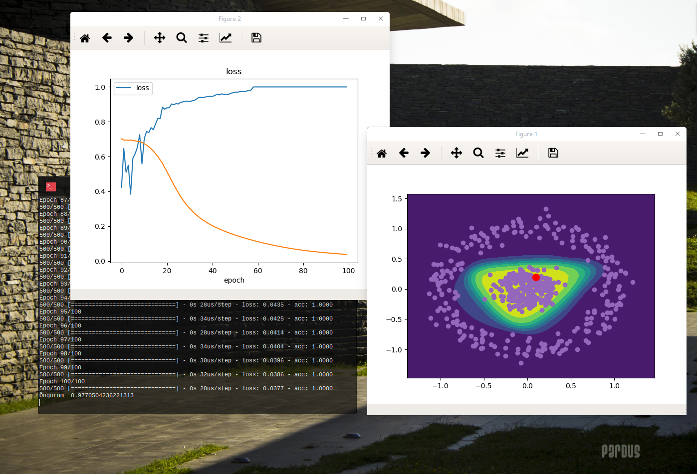

# Python <!-- omit in toc -->

[The Complete Self-Driving Car Course - Applied Deep Learning 🚗](https://www.udemy.com/applied-deep-learningtm-the-complete-self-driving-car-course/) kursu üzerindeki çalışmalarımı temel almaktadır.

- Genel python çalışmalarım, oluşturduğum ek notlara [buraya](kaynaklar/Kendi%20Notlar%C4%B1m%20~%20SDC.pdf) tıklayarak ulaşabilirsin.
- Microsoft ML cheat sheet için [buraya](kaynaklar%2Fmicrosoft-machine-learning-algorithm-cheat-sheet-v7.pdf) bakabilirsin.

## İçerikler <!-- omit in toc -->

- [Temel Notlar](#temel-notlar)
  - [Notebook (.ipynb) dosyalarını açmak için](#notebook-ipynb-dosyalar%C4%B1n%C4%B1-a%C3%A7mak-i%C3%A7in)
    - [Google Colab](#google-colab)
    - [Anaconda - Jupyter Lab](#anaconda---jupyter-lab)
  - [Hazır Modeller](#haz%C4%B1r-modeller)
- [1. Başlagıç](#1-ba%C5%9Flag%C4%B1%C3%A7)
- [2. OpenCV Çizgi Algılama](#2-opencv-%C3%A7izgi-alg%C4%B1lama)
- [2.1 OpenCV Orta Çizgiyi Hesaplama](#21-opencv-orta-%C3%A7izgiyi-hesaplama)
- [3. Makine Öğrenimi](#3-makine-%C3%B6%C4%9Frenimi)
- [4. Derin Sinir Ağları](#4-derin-sinir-a%C4%9Flar%C4%B1)
- [5. Çoklu Sınıflandırma](#5-%C3%A7oklu-s%C4%B1n%C4%B1fland%C4%B1rma)
- [6. Derin Öğrenme](#6-derin-%C3%B6%C4%9Frenme)
- [7. Evirişimli Sinir Ağları](#7-eviri%C5%9Fimli-sinir-a%C4%9Flar%C4%B1)
- [8. Polynomal Regresyon](#8-polynomal-regresyon)
- [9. Traffik İşaretlerini Algılama](#9-traffik-i%CC%87%C5%9Faretlerini-alg%C4%B1lama)
- [a1. Davranış Klonlama](#a1-davran%C4%B1%C5%9F-klonlama)
- [a1. Model Kullanımı](#a1-model-kullan%C4%B1m%C4%B1)
- [a3. Kapanış](#a3-kapan%C4%B1%C5%9F)

## Temel Notlar

### Notebook (.ipynb) dosyalarını açmak için

#### Google Colab

Google colab ile notbook dosyalarını (.ipybn) [buraya](https://colab.research.google.com/) tıklayarak çalıştırabilirsin. 

> İndirme gerektirmez, bulut üzerinden çalışır ve oldukça **hızlıdır**. (*Bilgisayarını yormaz*)
>
> `Runtime - Change Runtime Type -  Hardware Accelator - GPU` seçmeyi unutmayın.

#### Anaconda - Jupyter Lab

Anaconda3 indirerek, uygulama üzerinden jupyter lab'ı kullanabilirsin.

> Google Colab kullanman önerilir. Makine öğrenimi işlemleri cpu / gpu yoran işlemlerdir. Kendi bilgisayarını yorma :)

### Hazır Modeller

Tensotflow öğrenilmiş modeller için [buraya](https://github.com/tensorflow/models/blob/master/research/object_detection/g3doc/detection_model_zoo.md) tıklayabilirsin.

---

## 1. Başlagıç

- [Pyhton_Numpy_Begin](./1.%20Ba%C5%9Flag%C4%B1%C3%A7/Pyhton_Numpy_Begin.py)

## 2. OpenCV Çizgi Algılama

Yol resmindeki şeritleri algılama ve çizgileri oluşturma

- [cizgiler](./2.%20OpenCV%20%C3%87izgi%20Alg%C4%B1lama/cizgiler.py)

## 2.1 OpenCV Orta Çizgiyi Hesaplama

- [cizgiler](./2.1%20OpenCV%20Orta%20%C3%87izgiyi%20Hesaplama/cizgiler.py)

## 3. Makine Öğrenimi

Nokta kümesine uygun optimum referans çizgisini *supervised learning* sistemi ve *classification* yöntemi ile belirleme

- [1. Begin](./3.%20Makine%20%C3%96%C4%9Frenimi/1.%20Begin.ipynb)
- [2. Sigmoid](./3.%20Makine%20%C3%96%C4%9Frenimi/2.%20Sigmoid.ipynb)
- [3. Cross Entropy](./3.%20Makine%20%C3%96%C4%9Frenimi/3.%20Cross%20Entropy.ipynb)
- [4. Gradient Descent](./3.%20Makine%20%C3%96%C4%9Frenimi/4.%20Gradient%20Descent.ipynb)
- [mi](./3.%20Makine%20%C3%96%C4%9Frenimi/mi.py)

## 4. Derin Sinir Ağları

Nokta kümesine uygun referans alanı oluşturma

> Tensorflow oynama alanına [buraya](https://playground.tensorflow.org/) tıklayarak erişebilirsin.
>
> - *Supervised Learning*
> - Problem Type: *Classification*
> - Activition: *Sigmoid*
> - Epoch = *100*
> - Learning Rate = *0.1*

- [Deep_Neural_Network](./4.%20Derin%20Sinir%20A%C4%9Flar%C4%B1/Deep_Neural_Network.ipynb)
- [Perceptron](./4.%20Derin%20Sinir%20A%C4%9Flar%C4%B1/Perceptron.ipynb)
- [derin_sinir_aglari](./4.%20Derin%20Sinir%20A%C4%9Flar%C4%B1/derin_sinir_aglari.py)

> **Kırmızı** nokta bilinmeyen bir girdiyi temsil eder.

## 5. Çoklu Sınıflandırma

0, 1 Türünde *one encoded output* yerine, 0, 1, 2, 3, 4, ... şeklinde *hot encoded ouput* üzerinde uygun referans alanı oluşturma

- *Supervised Learning*
- Problem Type: *Multi-Classification*
- Activition: *Softmax*
- Epoch = *100*

> **Beyaz** nokta bilinmeyen bir girdiyi temsil eder.

- [Multiclassification](./5.%20%C3%87oklu%20S%C4%B1n%C4%B1fland%C4%B1rma/Multiclassification.ipynb)
- [multi_classification](./5.%20%C3%87oklu%20S%C4%B1n%C4%B1fland%C4%B1rma/multi_classification.py)

## 6. Derin Öğrenme

> - Çok fazla ve gerçek veriler üzerinde işlemler yapılmıştır.
> - Gerekli katmanlar kullanılmadığı için *hatalıdır*.

- [mnist](./6.%20Derin%20%C3%96%C4%9Frenme/mnist.ipynb)

## 7. Evirişimli Sinir Ağları

- Özel katmanlar kullanılmıştır.

  - *Conv Layer*
  - *Pool Layer*
  - *Flatten Layer*
  - *Dropout Layer*

- Katmanların çıktıları görselleştirilmiştir.

> Bu aşamadan itibaren `jupyter lab` yerine `google colab` kullanılması tavsiye edilir. Sistemi yoracak işlemlere başlanmıştır.

- [cnn](./7.%20Eviri%C5%9Fimli%20Sinir%20A%C4%9Flar%C4%B1/cnn.ipynb)

## 8. Polynomal Regresyon

- [Polynomial-Regression](./8.%20Polynomal%20Regresyon/Polynomial-Regression.ipynb)

> Bu aşamadan itibaren `jupyter lab` yerine `google colab` kullanılması tavsiye edilir. Sistemi yoracak işlemlere başlanmıştır.

## 9. Traffik İşaretlerini Algılama

- [TrafficSigns](./9.%20Traffik%20%C4%B0%C5%9Faretlerini%20Alg%C4%B1lama/TrafficSigns.ipynb)

## a1. Davranış Klonlama

- [Behavioral_Clonning](./a1.%20Davran%C4%B1%C5%9F%20Klonlama/Behavioral_Clonning.ipynb)
- [udacity-simulated-model](./a1.%20Davran%C4%B1%C5%9F%20Klonlama/udacity-simulated-model.h5)

## a1. Model Kullanımı

- [1-flask-tutorial](./a1.%20Model%20Kullan%C4%B1m%C4%B1/1-flask-tutorial.py)
- [2-first-drive](./a1.%20Model%20Kullan%C4%B1m%C4%B1/2-first-drive.py)
- [3-ilk-model-calismasi](./a1.%20Model%20Kullan%C4%B1m%C4%B1/3-ilk-model-calismasi.py)
- [README](./a1.%20Model%20Kullan%C4%B1m%C4%B1/README.md)
- [drive](./a1.%20Model%20Kullan%C4%B1m%C4%B1/drive.py)
- [original-drive](./a1.%20Model%20Kullan%C4%B1m%C4%B1/original-drive.py)
- [requirement](./a1.%20Model%20Kullan%C4%B1m%C4%B1/requirement.bat)
- [requirements](./a1.%20Model%20Kullan%C4%B1m%C4%B1/requirements.txt)
- [udacity-simulated-model](./a1.%20Model%20Kullan%C4%B1m%C4%B1/udacity-simulated-model.h5)

## a3. Kapanış

- [Behavioral_Clonning](./a3.%20Kapan%C4%B1%C5%9F/Behavioral_Clonning.ipynb)
- [README](./a3.%20Kapan%C4%B1%C5%9F/README.md)
- [drive](./a3.%20Kapan%C4%B1%C5%9F/drive.py)
- [genereted-udacity-simulated-model](./a3.%20Kapan%C4%B1%C5%9F/genereted-udacity-simulated-model.h5)
- [requirement](./a3.%20Kapan%C4%B1%C5%9F/requirement.bat)

